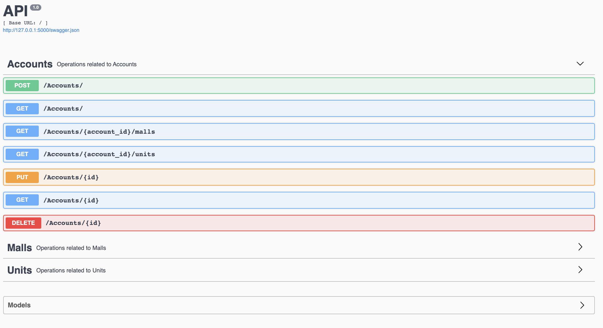

## Digeiz Test
###  digeiz_api structure

```bash
.
├── api
│       ├── custom_exceptions.py
│       ├── db_access_module.py
│       ├── ApiModels.py
│       ├── endpoints
│       │       ├── accounts.py
│       │       ├── malls.py
│       │       └── units.py
├── database
│       └── models.py
├── test
│       ├── __init__.py
│       └──  test_flask_api.py
├── __init__.py
├── app.py
└── test_api.db
```
### Run the application

```shell
pipenv install
pipenv shell
cd Digeiz_test/digeiz_api
flask run
```

### Run tests

```shell
pipenv shell
cd Digeiz_test
python -m unittest -v digeiz_api/test/test_flask_api.py
```
##### expected results
```
ok
test_change_name_single_valid_account_endpoint (digeiz_api.test.test_flask_api.TestFlaskApi) ... ok
test_create_account_endpoint_valid_payload_and_check_get_all_account (digeiz_api.test.test_flask_api.TestFlaskApi) ... ok
test_delete_invalid_account_endpoint (digeiz_api.test.test_flask_api.TestFlaskApi) ... ok
test_delete_valid_account_endpoint (digeiz_api.test.test_flask_api.TestFlaskApi) ... ok
test_get_all_accounts_endpoint_empty (digeiz_api.test.test_flask_api.TestFlaskApi) ... ok
test_get_single_account_endpoint (digeiz_api.test.test_flask_api.TestFlaskApi) ... ok

----------------------------------------------------------------------
Ran 7 tests in 0.213s

OK
```

### Main Features
- Open API spec that may be used for server and client generation in different languages ( Bulk insert for Accounts )
- Customized Error handling
- Unit tests

### Preview
- localhost:5000 will display the open api interface that lists endpoints and the object models, each endpoint comes with its response model. It's also convenient when testing manually the api
- you can access to the API spec through http://localhost:5000/swagger.json



### Enhancements
- Add more unit/integration tests for better code coverage